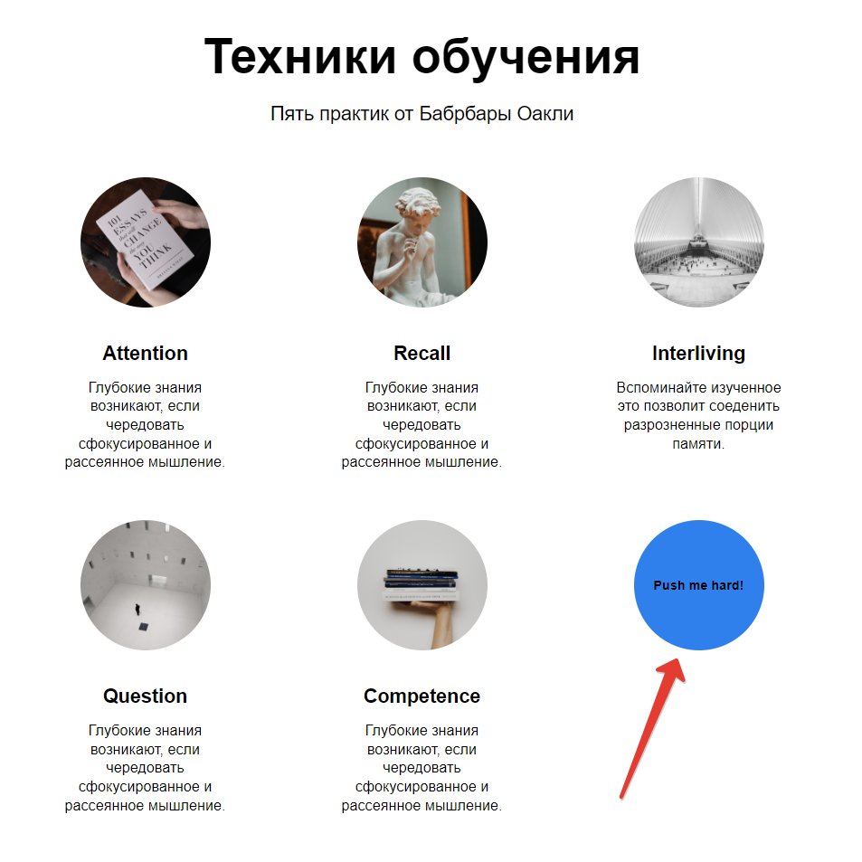
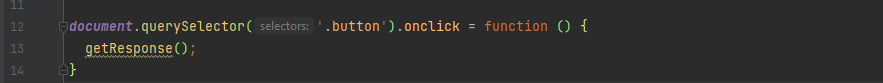
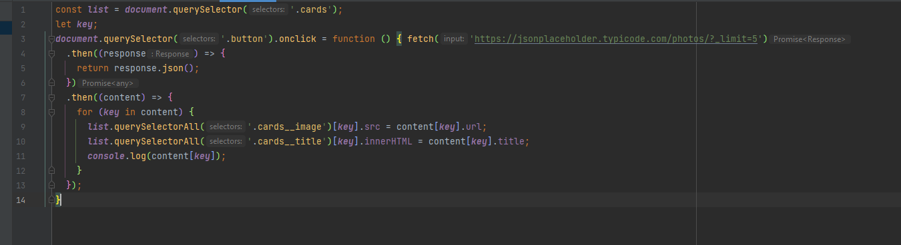
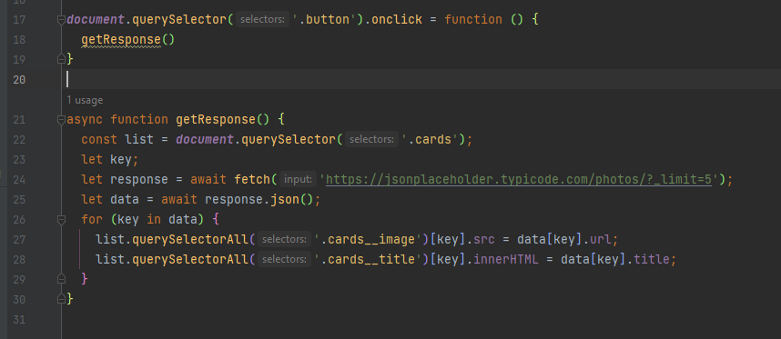
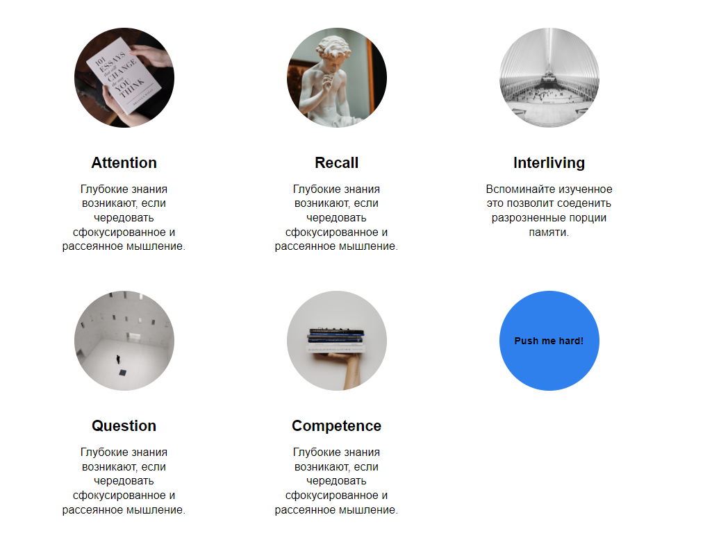
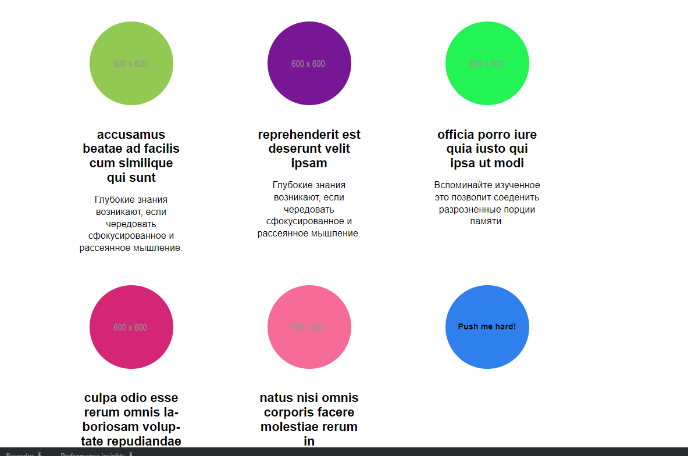

# Ход работы

### Создание кнопки:

### Подключение скрипта:
Подключил файл со скриптом в html;

### При нажатии на кнопку запускается скрипт:

### Суть скрипта в получении информации из JSON файла и использовании для вставки на страницу данных;

### Есть второй вариант скрипта через асинхронную функцию:

### До нажатия на кнопку:

### После нажатия на кнопку:

